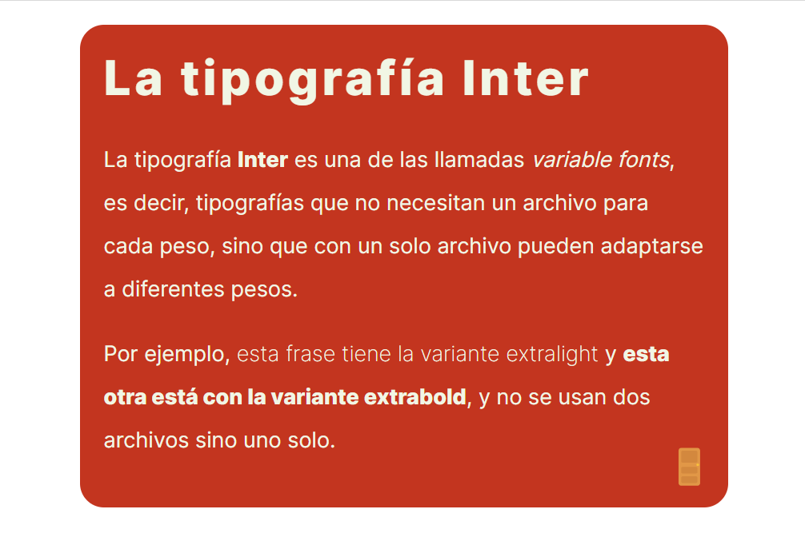

# Kata 0: Inter

Haz un fork de este codepen: https://codepen.io/mariogl/pen/abQJVKg

Se te da un HTML y las siguientes indicaciones, para maquetar el componente que puedes ver en la imagen inter.png que hay en esta misma carpeta: 

- El color de fondo es #c3351f.
- El color del texto es #f1f6e5.
- La tipografía usada es la Inter, ya está cargada con los pesos necesarios desde Google Fonts.
- El tamaño de la tipografía en el título es 40pt.
- El tamaño de la tipografía en los párrafos es 18pt.
- El interlineado en los párrafos es de 2.
- El contenedor mide 500px de ancho.

Usa variables para crear una buena arquitectura CSS. Corrige lo que sea necesario en el HTML y modifica lo que creas que se puede mejorar en el resultado final.

Ten en cuenta siempre la accesibilidad.
